# Release Flow Framework

> **⚠️ Experimental — Use with caution**
>
> This framework uses **unmanaged AI** to autonomously modify code, create branches,
> open pull requests, and optionally merge them — **without human approval in the loop**
> when auto-merge is enabled. AI-generated changes may introduce bugs, security
> vulnerabilities, or unintended behaviour. **Always review PRs before merging in
> production repositories.** Run in a sandboxed or non-critical repo until you are
> confident in the workflow.

A self-contained, pluggable framework for automated code improvement using GitHub Copilot SDK. This framework creates a continuous improvement loop that evaluates your codebase, implements changes, raises PRs, and optionally auto-merges them.

An optional **Operator** (a second LLM acting as product owner and judge) can be enabled to assess the codebase, define a roadmap, generate prompts, and evaluate the agent's work — all using a different model for independent oversight.

## 🔒 Security

This framework implements comprehensive security measures to protect against common vulnerabilities:

- **Command Injection Prevention**: All subprocess calls use parameterized arguments
- **Path Traversal Protection**: File paths are validated and sanitized
- **Token Security**: GitHub tokens never exposed in logs or error messages
- **Input Validation**: All user input sanitized with length limits
- **Resource Limits**: Protection against DoS via large files or inputs

See [SECURITY.md](SECURITY.md) for detailed security documentation.

## Features

- **Automated Code Improvement**: Use Copilot to analyze and improve your codebase
- **Operator (Optional, LLM-as-Judge)**: A second LLM acts as product owner — assesses the codebase, defines a roadmap, generates prompts, and judges the agent's changes
- **Model Separation**: The Operator deliberately uses a different model from the agent to avoid echo-chamber effects
- **PR Workflow**: Automatically create branches, commits, and pull requests
- **CI Integration**: Wait for CI checks before merging
- **Continuous Mode**: Run multiple improvement iterations automatically
- **Highly Configurable**: Customize every aspect of the workflow
- **Easy Integration**: Drop into any Python project
- **Callbacks**: Hook into the workflow for custom integrations

---

## Quick Start

### 1. Install

```bash
git clone https://github.com/shanepeckham/TheSingularityIsUponUs.git
cd TheSingularityIsUponUs

# Option A: uv (recommended)
uv sync

# Option B: pip
pip install -e .
```

### 2. Configure environment

```bash
cp .env.example .env
```

Edit `.env`:

```env
GITHUB_TOKEN=your_token_here        # or run: gh auth login
GITHUB_REPO_OWNER=your-username
GITHUB_REPO_NAME=your-repo
```

### 3. Create prompts

Create a `prompts.txt` file (one prompt per line, `#` lines are comments):

```text
# prompts.txt
Review security vulnerabilities and fix them
Add comprehensive error handling
Improve test coverage for edge cases
```

### 4. Run the agent

```bash
# Continuous mode — reads prompts.txt, creates PRs for each
uv run python -m release_flow --continuous --auto-merge

# Single prompt
uv run python -m release_flow --prompt "Add error handling" --auto-merge

# Limit to 5 iterations
uv run python -m release_flow --continuous -i 5 --auto-merge

# Use a specific model
uv run python -m release_flow --continuous --model gpt-4o --auto-merge
```

That's it — the agent will analyse your code, create branches, open PRs, wait for CI, and merge.

---

## Operator Setup (Optional)

The Operator is a second LLM that acts as **product owner and judge**. It is
**disabled by default** and entirely optional. Enable it when you want independent
oversight of the agent's work.

### Why a separate model?

Using the same model for both generating and evaluating code creates a blind spot —
the model may not catch its own systematic weaknesses. A different model brings
a fresh perspective and catches issues the first misses.

### Quick start with the Operator

```bash
# Step 1: Run the Operator to assess the codebase and generate prompts.txt
uv run python -m release_flow --assess

# Step 2: Run the agent with the Operator judging each iteration
uv run python -m release_flow --continuous --with-operator --auto-merge
```

By default the Operator uses `claude-3.5-sonnet` and the agent uses whatever
`--model` you provide. You can override both:

```bash
uv run python -m release_flow --continuous --with-operator \
  --model gpt-4o \
  --operator-model claude-3.5-sonnet \
  --auto-merge
```

### Operator modes

| Command | What it does |
|---|---|
| `--assess` | Operator-only — assess codebase, define roadmap, write `prompts.txt`. No agent work. |
| `--with-operator` | Enable Operator for continuous mode — assess before, judge after each iteration. |
| `--no-operator-judge` | Disable post-iteration judging (keep assessment + prompt generation only). |
| `--stop-on-fail-verdict` | Stop the continuous run if the Operator gives a FAIL verdict. |

### Operator pipeline

```mermaid
flowchart LR
    A[Assess\n8 dimensions] --> B[Roadmap\nPrioritise P0–P3]
    B --> C[Generate Prompts\nWrite prompts.txt]
    C --> D[Agent runs...]
    D --> E{Judge Changes\n6 criteria}
    E -- PASS --> F{More prompts?}
    E -- NEEDS_WORK --> D
    E -- FAIL --> G([Stop])
    F -- yes --> D
    F -- no --> H[Follow-up\nAppend unresolved\nto prompts.txt]
    H --> I([Done])

    style A fill:#e0d4fc,stroke:#7c3aed
    style B fill:#e0d4fc,stroke:#7c3aed
    style C fill:#e0d4fc,stroke:#7c3aed
    style E fill:#e0d4fc,stroke:#7c3aed
    style H fill:#e0d4fc,stroke:#7c3aed
```



| Step | What it does |
|---|---|
| **Assess** | Analyses the codebase across 8 dimensions (functionality, tests, security, quality, docs, architecture, error handling, performance) |
| **Roadmap** | Prioritises findings into a ranked list (P0–P3) |
| **Generate Prompts** | Converts roadmap items into actionable prompts and writes `prompts.txt` |
| **Judge** | After each agent iteration, evaluates changes on 6 criteria and issues a PASS / FAIL / NEEDS_WORK verdict |
| **Follow-up** | Appends unresolved items back to `prompts.txt` for the next cycle |

### Operator CLI options

```
--assess               Run Operator assessment only (no agent work)
--with-operator        Enable the Operator for continuous mode
--operator-model STR   Model for the Operator (default: claude-3.5-sonnet)
--operator-timeout INT Timeout for Operator LLM calls in seconds (default: 300)
--no-operator-judge    Disable post-iteration judging
--stop-on-fail-verdict Stop if Operator gives FAIL verdict
```

---

## Configuration

### Python API — basic (no Operator)

```python
import asyncio
from release_flow import ReleaseFlow, ReleaseFlowConfig

config = ReleaseFlowConfig(repo="owner/repo")
flow = ReleaseFlow(config)

result = asyncio.run(flow.run_single_iteration(
    prompt="Improve error handling",
    auto_merge=True,
))
print(f"PR: #{result['pr_number']}")
```

### Python API — with Operator

```python
import asyncio
from release_flow import (
    ReleaseFlow,
    ReleaseFlowConfig,
    CopilotConfig,
    OperatorConfig,
)

config = ReleaseFlowConfig(
    repo="owner/repo",
    copilot=CopilotConfig(model="gpt-4o"),
    operator=OperatorConfig(
        enabled=True,
        model="claude-3.5-sonnet",   # must differ from copilot model
    ),
)
flow = ReleaseFlow(config)
results = asyncio.run(flow.run_continuous(auto_merge=True))
```

### Full configuration reference

```python
from pathlib import Path
from release_flow import (
    ReleaseFlowConfig,
    GitConfig,
    CopilotConfig,
    PRConfig,
    ContinuousConfig,
    OperatorConfig,
)

config = ReleaseFlowConfig(
    # Required
    repo="owner/repo",
    
    # Optional
    local_path=Path("."),
    github_token="...",  # Falls back to GITHUB_TOKEN env or gh CLI
    
    # Custom prompts for continuous mode
    prompts=[
        "Fix security vulnerabilities",
        "Add unit tests",
        "Improve documentation",
    ],
    
    # Sub-configurations
    git=GitConfig(
        main_branch="main",
        branch_prefix="copilot-improvement",
        commit_prefix="🤖 Copilot:",
        auto_stash=True,
        force_reset=True,
    ),
    
    copilot=CopilotConfig(
        timeout=300,
        model="gpt-4o",              # or "claude-3.5-sonnet", None for default
        fallback_to_cli=True,
        cli_command="copilot",
    ),
    
    pr=PRConfig(
        title_prefix="🤖 Copilot:",
        auto_request_review=True,
        merge_method="squash",        # "merge", "squash", or "rebase"
        wait_for_ci=True,
        ci_timeout=600,
        delete_branch_after_merge=True,
    ),
    
    continuous=ContinuousConfig(
        max_iterations=10,
        delay_between_runs=3600,      # 1 hour
        stop_on_failure=False,
    ),
    
    # Operator — optional, disabled by default
    operator=OperatorConfig(
        enabled=True,                  # set to False (default) to disable
        model="claude-3.5-sonnet",     # must differ from copilot.model
        timeout=300,
        judge_after_iteration=True,
        generate_prompts_before_run=True,
        update_prompts_after_run=True,
        stop_on_fail_verdict=False,
    ),
)
```

### Callbacks

Hook into the workflow with callbacks:

```python
def on_iteration_start(iteration: int, prompt: str):
    print(f"Starting iteration {iteration}: {prompt}")

def on_pr_created(pr_number: int, url: str):
    slack_notify(f"New PR: {url}")

def on_error(e: Exception) -> bool:
    log_error(e)
    return True  # Continue, or False to stop

config = ReleaseFlowConfig(
    repo="owner/repo",
    on_iteration_start=on_iteration_start,
    on_pr_created=on_pr_created,
    on_error=on_error,
)
```

---

## CLI Reference

```
usage: release_flow [-h] [--prompt PROMPT | --continuous | --assess]
                    [--auto-merge] [--iterations N] [--delay SECONDS]
                    [--path PATH] [--prompts-file FILE] [--main-branch BRANCH]
                    [--no-wait-ci] [--merge-method METHOD] [--timeout SECONDS]
                    [--model MODEL] [--stop-on-failure]
                    [--with-operator] [--operator-model MODEL]
                    [--operator-timeout SECONDS] [--no-operator-judge]
                    [--stop-on-fail-verdict]

Agent Options:
  --prompt, -p         Single improvement prompt
  --continuous, -c     Run in continuous mode
  --auto-merge, -m     Auto-merge PRs after CI passes
  --iterations, -i     Max iterations (default: 10)
  --delay, -d          Delay between iterations in seconds (default: 3600)
  --path               Local repo path (default: .)
  --prompts-file       File with prompts (one per line, default: prompts.txt)
  --main-branch        Main branch name (default: main)
  --no-wait-ci         Skip CI check waiting
  --merge-method       Merge method: merge, squash, rebase (default: squash)
  --timeout            Copilot timeout in seconds (default: 300)
  --model              Copilot model (e.g., 'gpt-4o', 'claude-3.5-sonnet')
  --stop-on-failure    Stop if an iteration fails

Operator Options (all optional):
  --assess             Run Operator assessment only (no agent work)
  --with-operator      Enable the Operator for continuous mode
  --operator-model     Model for the Operator (default: claude-3.5-sonnet)
  --operator-timeout   Timeout for Operator LLM calls (default: 300)
  --no-operator-judge  Disable post-iteration judging
  --stop-on-fail-verdict  Stop if Operator gives FAIL verdict

Environment Variables:
  GITHUB_TOKEN         GitHub personal access token (or use 'gh auth login')
  GITHUB_REPO_OWNER    Repository owner (e.g., 'microsoft')
  GITHUB_REPO_NAME     Repository name (e.g., 'vscode')
```

### prompts.txt format

```text
# Lines starting with # are ignored
# One prompt per line

Review security vulnerabilities and fix them
Add comprehensive error handling
Improve test coverage for edge cases
Refactor for better maintainability
Update deprecated dependencies
```

### prompts.txt lifecycle


`prompts.txt` can be written manually **or** auto-generated by the Operator. After a run, the Operator appends any unresolved follow-up items back to the file, creating a self-improving feedback loop.

---

## Workflow

### Without Operator (default)

```mermaid
flowchart TD
    A([Start]) --> B[Initialize\nConnect to GitHub & Copilot SDK]
    B --> C[Clean State\nStash changes · checkout main · pull]
    C --> D[Create Branch\nFeature branch from main]
    D --> E[Evaluate\nSend prompt to Copilot · modify code]
    E --> F[Commit & Push]
    F --> G[Create PR]
    G --> H[Request Review\nCopilot reviews the PR]
    H --> I{Wait for CI}
    I -- passes --> J{Auto-merge?}
    I -- fails --> K([Done — manual fix needed])
    J -- yes --> L[Squash Merge]
    J -- no --> K2([Done — PR ready for review])
    L --> M{More prompts?}
    M -- yes --> C
    M -- no --> N([Done])
```



### With Operator enabled

```mermaid
flowchart TD
    A([Start]) --> OP1[Operator: Assess Codebase\n8 dimensions]
    OP1 --> OP2[Operator: Define Roadmap\nPrioritised P0–P3]
    OP2 --> OP3[Operator: Generate Prompts\nWrite prompts.txt]
    OP3 --> C[Clean State\nStash · checkout main · pull]
    C --> D[Create Branch]
    D --> E[Evaluate\nSend prompt to Copilot · modify code]
    E --> F[Commit & Push]
    F --> G[Create PR]
    G --> H[Request Review]
    H --> OP4{Operator: Judge Changes}
    OP4 -- PASS --> I{Wait for CI}
    OP4 -- NEEDS_WORK --> E
    OP4 -- FAIL --> STOP([Stop — fail verdict])
    I -- passes --> J{Auto-merge?}
    I -- fails --> K([Done — manual fix needed])
    J -- yes --> L[Squash Merge]
    J -- no --> K2([Done — PR ready for review])
    L --> M{More prompts?}
    M -- yes --> C
    M -- no --> OP5[Operator: Post-Run\nAppend follow-ups to prompts.txt]
    OP5 --> N([Done])

    style OP1 fill:#e0d4fc,stroke:#7c3aed
    style OP2 fill:#e0d4fc,stroke:#7c3aed
    style OP3 fill:#e0d4fc,stroke:#7c3aed
    style OP4 fill:#e0d4fc,stroke:#7c3aed
    style OP5 fill:#e0d4fc,stroke:#7c3aed
```



**Legend**: Purple nodes are Operator steps (optional, using a second LLM).

---

## Integration Examples

### GitHub Actions

```yaml
# .github/workflows/release-flow.yml
name: Release Flow

on:
  schedule:
    - cron: '0 0 * * 0'  # Weekly
  workflow_dispatch:
    inputs:
      prompt:
        description: 'Improvement prompt'
        required: false

jobs:
  improve:
    runs-on: ubuntu-latest
    steps:
      - uses: actions/checkout@v4
      
      - uses: actions/setup-python@v5
        with:
          python-version: '3.12'
      
      - name: Install dependencies
        run: pip install PyGithub github-copilot-sdk python-dotenv
      
      - name: Run Release Flow
        env:
          GITHUB_TOKEN: ${{ secrets.GITHUB_TOKEN }}
          GITHUB_REPO_OWNER: ${{ github.repository_owner }}
          GITHUB_REPO_NAME: ${{ github.event.repository.name }}
        run: |
          if [ -n "${{ github.event.inputs.prompt }}" ]; then
            python -m release_flow \
              --prompt "${{ github.event.inputs.prompt }}" --auto-merge
          else
            python -m release_flow \
              --continuous --iterations 1 --auto-merge
          fi
```

### GitHub Actions — with Operator

```yaml
      - name: Run Release Flow with Operator
        env:
          GITHUB_TOKEN: ${{ secrets.GITHUB_TOKEN }}
          GITHUB_REPO_OWNER: ${{ github.repository_owner }}
          GITHUB_REPO_NAME: ${{ github.event.repository.name }}
        run: |
          python -m release_flow --continuous --with-operator \
            --model gpt-4o --operator-model claude-3.5-sonnet \
            --iterations 3 --auto-merge
```

### Programmatic Integration

```python
import asyncio
from release_flow import ReleaseFlow, ReleaseFlowConfig, ContinuousConfig

async def run_improvements():
    config = ReleaseFlowConfig(
        repo="my-org/my-repo",
        prompts=[
            "Analyze this codebase and suggest architectural improvements",
            "Find and fix potential memory leaks",
            "Add input validation where missing",
        ],
        continuous=ContinuousConfig(
            max_iterations=3,
            delay_between_runs=60,
        ),
    )
    
    flow = ReleaseFlow(config)
    results = await flow.run_continuous(auto_merge=False)
    
    for r in results:
        if r["success"] and r["pr_number"]:
            print(f"Review needed: https://github.com/my-org/my-repo/pull/{r['pr_number']}")
    
    return results

if __name__ == "__main__":
    asyncio.run(run_improvements())
```

---

## File Structure

```
release_flow/
├── __init__.py      # Package exports (Operator is lazy-loaded)
├── __main__.py      # python -m release_flow support
├── cli.py           # Command-line interface
├── config.py        # Configuration dataclasses (incl. OperatorConfig)
├── core.py          # Main ReleaseFlow class (with optional Operator hooks)
├── judge.py         # Operator: LLM-as-judge / product owner (optional)
prompts.txt          # Agent prompts (can be auto-generated by the Operator)
pyproject.toml       # Package configuration
tests/               # Test suite
```

## Requirements

- Python 3.10+
- GitHub token with `repo` and `workflow` permissions
- GitHub Copilot subscription (for Copilot SDK)
- Git installed locally

## Testing

```bash
# Run all tests
python -m pytest tests/ -v

# Run just operator tests
python -m pytest tests/test_operator.py -v
```

## Security

This framework has been hardened against common security vulnerabilities:

- ✅ Command injection prevention
- ✅ Path traversal protection  
- ✅ Token exposure prevention
- ✅ Input validation and sanitization
- ✅ Resource exhaustion protection
- ✅ Subprocess security

For detailed security information, see [SECURITY.md](SECURITY.md).

### Security Best Practices

1. Store tokens securely using environment variables or GitHub CLI
2. Only run on trusted repositories
3. Enable branch protection and require code reviews
4. Monitor PR creation activity
5. Use prompts from trusted sources only

## License

MIT License — see LICENSE file for details.

## Contributing

Contributions welcome! Please open an issue or PR.
